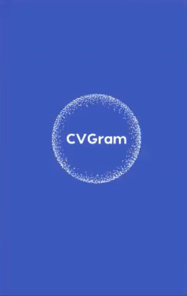
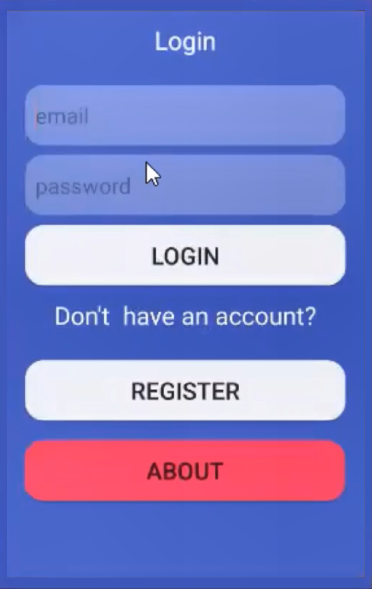
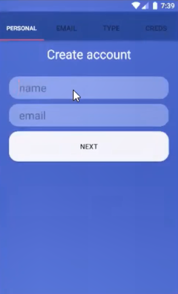
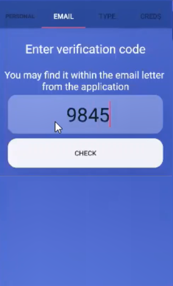
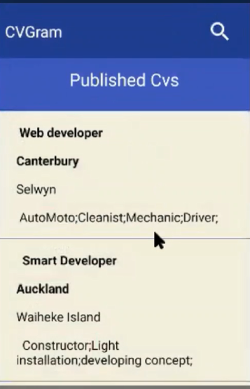
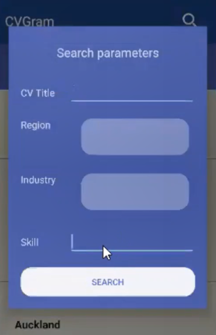
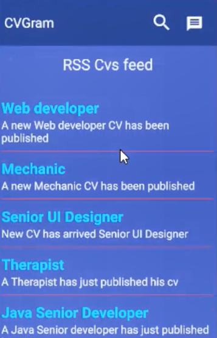
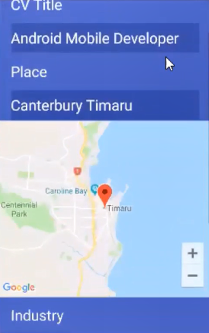

# CVGram-Android-Client
A simple Android application that connects employees with their potential employers in a convenient way 

This application is a client for the Android platform for a web service that provides the ability to publish a CV 
of a person who is looking for a job and gives the opportunity to a potential employer to find and see that information.

## Available functions
### Provide the opportunity to register
Register Page provides the functionality to enroll in the system whether the user is a job seeker or potential employer.

### Login into the system 
With credentials that have got through the registration process, a user is able to login to the system.
###	Publish a user CV 
Ability to publish CV within the system for a job seeker.
###	Provide statistical information about CV
Present information about who and how often reviewed the published CV as well as the last time the CV was edited. 
###	Provide feedback from employers
Get messages from future employers with time and their contact data.
###	Search for a CV using filters
Present form for search and filter the list of published CV. Display full information about selected CV.

## Screenshots
### Splash screen

### Main menu

### Create account

### Curriculum Vitaes list and its search

### Recently published Curriculum Vitaes RSS feed

### Selected Curriculum Vitae details

